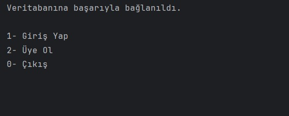
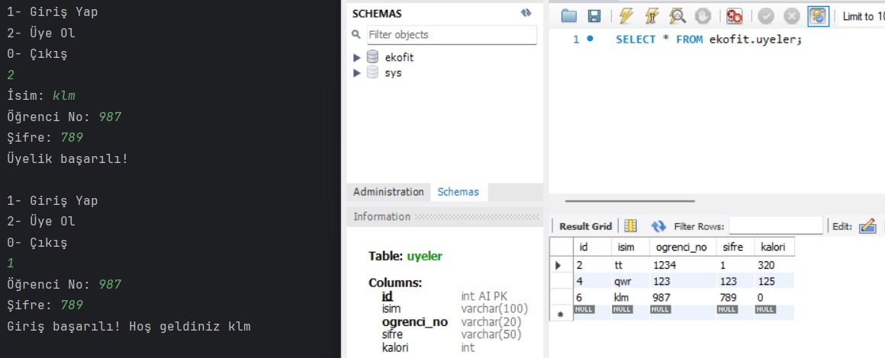
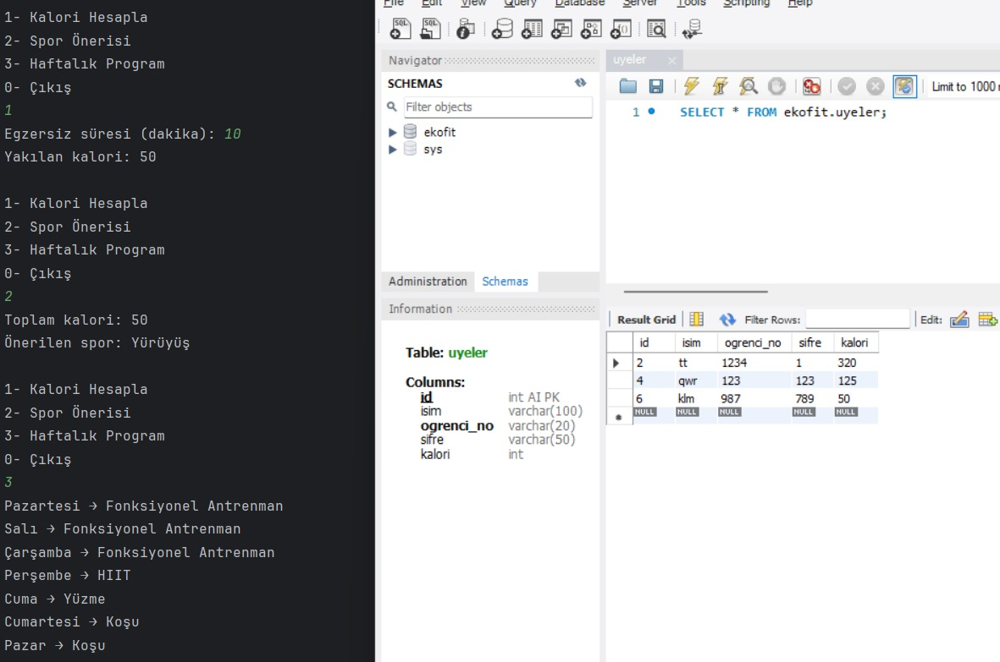
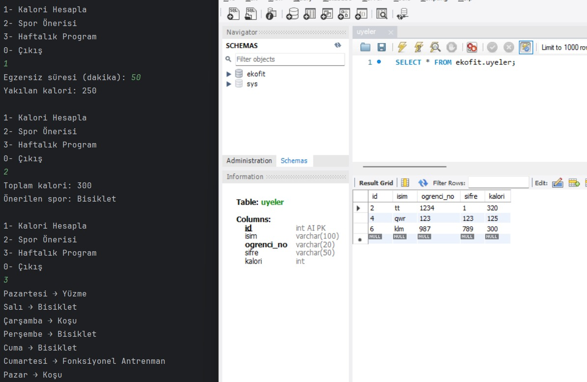

# ekofit_programı

Kişinin üye olup; kullanıcı adı veya şifresi ile giriş yapabildiği, çıkışta ise plakasını girerek içerde kalma süresinde göre indirim aldığı otomasyon.
## anasayfa

## kullanıcı kayıt yapıp giriş yaptıktan sonra kullanıcının karşısına çıkan bölüm

## kullanıcı kalori hesabı ve haftalık program

## kullanıcı tekrardan kalori hesabı yaptırmak isterse sistem tarafından yeni kalori eski kalorinin üstüne eklenerek kullanıcıya yeni bir haftalık program oluşturuluyor

